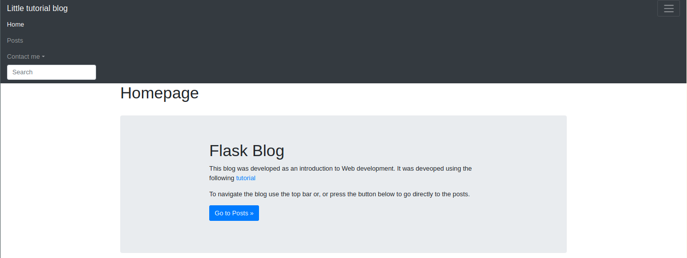
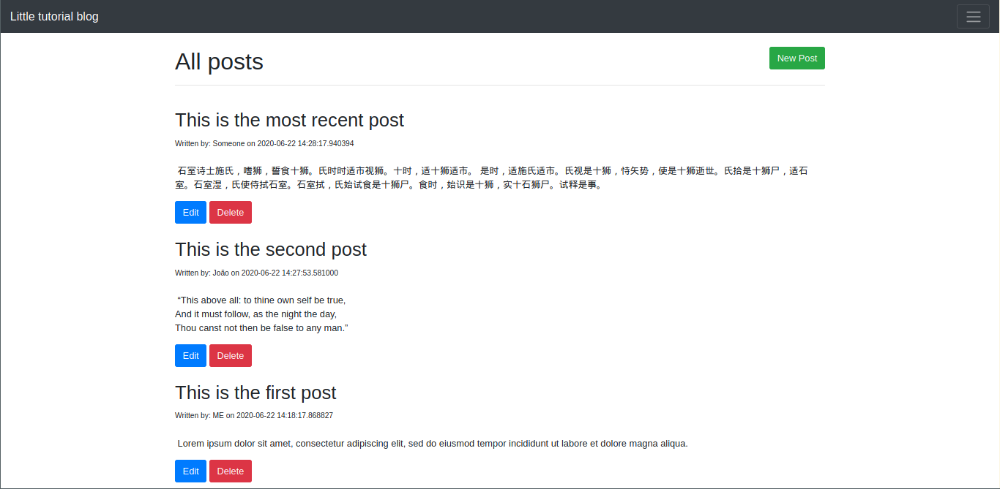
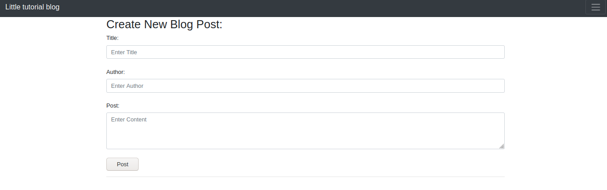

# Flask-Blog

Little blog developed in Flask (& a bit of bootstrap) as an introduction to the framework and webdev in general.

It was developed using the following [tutorial](https://www.youtube.com/watch?v=3mwFC4SHY-Y).

## How to run
Firstly run
  > pip install -r requirements.txt (Python 2), or pip3 install -r requirements.txt (Python 3)

This repo already contains a db but if one wants to create it by himself just delete *posts.dd*, open a python prompt and write the following:

> from my_app import db
> 
>   db.create_all()

## Screenshots 
### Homepage

### Posts feed

### Creating a post

